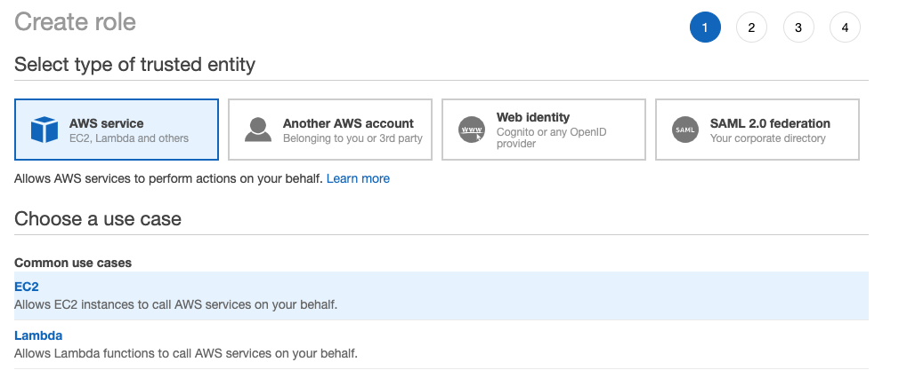

# Cloud9

ユーザ登録処理を実行する Cloud9 の設定や script に関するプロジェクトです。

## 注意事項

- Cloud9 上で CSV を管理して編集する場合、正しい形式の CSV で保存してください。形式がよくわからない場合は、Excel などのツールで生成したものを Cloud9 にアップロードすることをおすすめします。

    ■ 例: パスワードにカンマを含む場合 (CSV を Excel などで見たときの PW: `sample,password`)
    ```
    Email,Password,Language
    sample-user@example.com,"sample,password",ja
    ```

    ■ 例: パスワードカンマとダブルクオートを含む場合 (CSV を Excel などで見たときの PW: `sample,password-"!`)
    ```
    Email,Password,Language
    sample-user@example.com,"sample,password-""!",ja
    ```


## ユーザ登録方法

以下の手順は [Cloud9 設定](#Cloud9-設定) が全て完了している想定で書かれています。

1. CSV ファイルに登録するユーザの一覧を作成する

    - `cloud9/scripts/users-template.csv` をコピーして利用している場合は気にする必要はありませんが、CSV に記載する各項目の順番は **Email, Password, Language の順番** でお願いします。
    - CSV のファイル名は下記の表に従い、登録対象の環境により名前を変更してください。

    ■ CSV ファイルの名前
    | 環境  | ファイル名      |
    |------|----------------|
    | Demo | users-Demo.csv |
    | Test | users-Test.csv |
    | Dev  | users-Dev.csv  |

    ■ CSV で必要なパラメータ
    | 項目名    | 説明 |
    |----------|-----|
    | Email    | ユーザのメールアドレス。App にサインインする際に使われます。 |
    | Password | サインインする際に使われるパスワードです。 |
    | Language | 多言語対応のための項目です。設定可能値は以下の表を参照。 |


    ■ Language の値
    | 値 | 説明 |
    |----|------|
    | ja | 日本語で UI を表示するユーザに設定する値。 |
    | en | 英語で UI を表示するユーザに設定する値。 |

    ■ CSV の例
    ```
    Email,Password,Language
    sample-ja@example.com,some-password,ja
    sample-en@example.com,some-password,en
    ```

1. CSV ファイルを Cloud9 にアップロードする

    - Cloud9 IDE 上で左に表示されているディレクトリツリーから `monitoring/cloud9/scripts` ディレクトリに作成した CSV ファイルを Drag and Drop でアップロードしてください。

1. ユーザ登録スクリプトを実行する

    - 下記の表に従って実行対象の環境用のスクリプトを実行してください。
    - スクリプトの実行は以下のいずれかの方法があります
      + Cloud9 で実行対象のスクリプトをダブルクリックで開いた状態で、画面上部の `Run` というボタンを押す
      + Terminal で該当スクリプトを実行する

    ■ 実行するスクリプト
    | 環境  | ファイル名                   |
    |------|-----------------------------|
    | Demo | `register-user-for-demo.sh` |
    | Test | `register-user-for-test.sh` |
    | Dev  | `register-user-for-dev.sh`  |


## Cloud9 設定

- CloudFormation で実施するほどの規模ではないので、手動で設定をする。
- **デフォルト設定だと Cloud9 の環境を作成した IAM ユーザの認証情報がセットされるので注意が必要です。[Cloud9 の環境構築](#Cloud9-の環境構築) の後半に従って Cloud9 を実行する EC2 Instance に attach するロールを設定してください。**

### Cloud9 の環境構築

1. AWS Management Console から Cloud9 の Console を開く
1. `Create environment` ボタンを押して設定を開始する
1. Name, Description を適切に設定する
1. `Environment type` で以下の設定を選択する

    

1. `Instance type` は `t2.micro` を選択する。

    あまりにもパフォーマンスが悪く Instance type を変更する必要がある場合は以下のドキュメントに従って設定を行うか、新しく Cloud9 の環境を作成する。

    https://docs.aws.amazon.com/cloud9/latest/user-guide/move-environment.html
1. `Platform` の項目は `Amazon Linux 2 (recommended)` を選択する

    

1. それ以外の設定はデフォルトのままで `Next step` を押す
1. Review 画面が表示されるので、内容を確認し、問題ないようであれば `Create environment` のボタンを押す
1. AWS Management Console で IAM の Console を開き、Cloud9 を実行している EC2 Instance に attach するための Role を作成する
    - `Choose a use case` の項目は `EC2` を選択する

      

    - `Permission` は以下の 3 つを選択する
      + AmazonCognitoPowerUser
      + AmazonSSMReadOnlyAccess
      + AWSCloud9SSMInstanceProfile

      以下の図は Role 作成後に取得したスクリーンショット。

      

1. 作成した Role の `Trust relationships` を編集して cloud9 を追加する

    以下のような状態になるように編集する。
    ```
    {
      "Version": "2012-10-17",
      "Statement": [
        {
          "Effect": "Allow",
          "Principal": {
            "Service": [
              "cloud9.amazonaws.com",
              "ec2.amazonaws.com"
            ]
          },
          "Action": "sts:AssumeRole"
        }
      ]
    }
    ```

    

1. EC2 の Console を開き、Cloud9 を実行している EC2 Instance の Role を先程作った Role に切り替える。


### Cloud9 内部での設定

- 上記の手順にて環境構築を行い、 Cloud9 IDE にアクセスできるようになったら以下の操作を行う。
- **設定で必ず `AWS managed temporary credentials` を off にしてください。**

#### AWS managed temporary credentials を off にする

1. Cloud9 IDE を開く
1. 右上の歯車マークを押して設定メニューを開く
1. `AWS Settings` をサイドメニューから選択し、`Credentials` 項目内の `AWS managed temporary credentials` を Off にする。

   

#### Cloud9 を作成者以外のメンバーにも共有する

- 初期状態で Cloud9 は環境を作成した IAM ユーザにのみアクセス権限があるため、他の IAM ユーザにも操作権限を与えたい場合は以下のドキュメントを参考に設定を行う

    https://docs.aws.amazon.com/ja_jp/cloud9/latest/user-guide/share-environment.html#share-environment-invite-user

- スクリプトを実行するためには権限を `Read and Write` で設定する必要があるので注意

#### AWS CLI を version 2 に更新

Cloud９ 環境 (Amazon Linux 2) にデフォルトでインストールされている AWS CLI は v1 なので、AWS CLI v2 にアップグレードする。

1. terminal で以下のコマンドを実行し AWS CLI v1 をアンインストールする

    ```
    $ sudo pip uninstall awscli -y
    ```

2. AWS CLI v2 をインストールする

    ```
    $ mkdir temp
    $ cd temp
    $ curl "https://awscli.amazonaws.com/awscli-exe-linux-x86_64.zip" -o "awscliv2.zip"
    $ unzip awscliv2.zip
    $ sudo ./aws/install
    ```

    詳細は以下の AWS Document を参照。

      - https://docs.aws.amazon.com/cli/latest/userguide/install-cliv2-linux.html

3. 次のコマンドを terminal で実行し、 v2 に切り替わったことを確認する

    ```
    $ source ~/.bash_profile
    $ aws --version
    ```

#### jq コマンドのインストール

AWS CLI からのレスポンスが JSON のため、それを shell で扱うために jq をインストールする。

1. terminal で以下のコマンドを実行する

    ```
    $ sudo yum install -y jq
    ```

#### ユーザ登録用のスクリプトを GitHub から入手する

1. 以下のコマンドを実行して本 GitHub Repository を clone する

    ```
    $ cd ~/environment
    $ git clone <REPOSITORY_URL>
    ```
